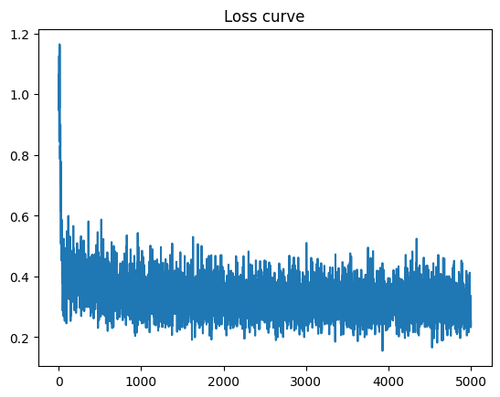
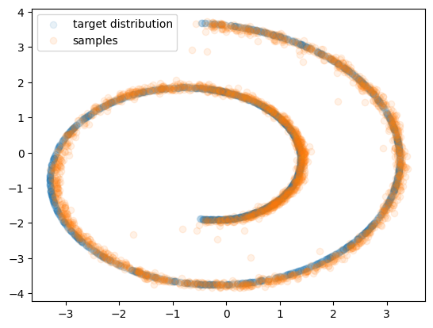
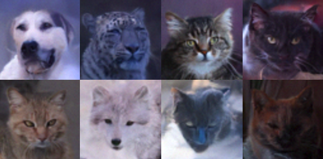
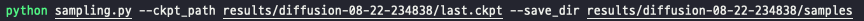
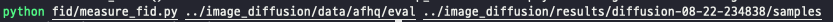
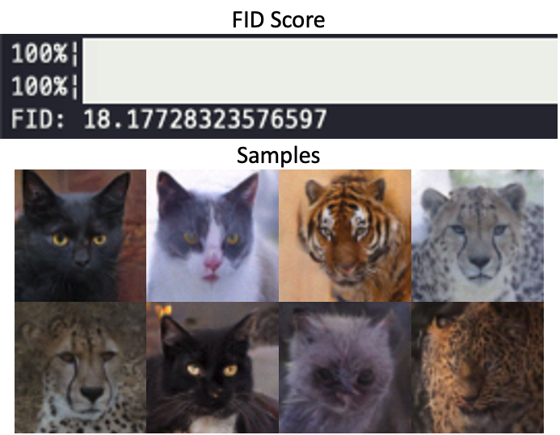

<div align=center>
  <h1>
  Denoising Diffusion Probabilistic Models (DDPM)  
  </h1>
  <p>
    <a href=https://mhsung.github.io/kaist-cs492d-fall-2024/ target="_blank"><b>KAIST CS492(D): Diffusion Models and Their Applications (Fall 2024)</b></a><br>
    Programming Assignment 1
  </p>
</div> 

<div align=center>
  <p>
    Instructor: <a href=https://mhsung.github.io target="_blank"><b>Minhyuk Sung</b></a> (mhsung [at] kaist.ac.kr)<br>
    TA: <a href=https://dvelopery0115.github.io target="_blank"><b>Seungwoo Yoo</b></a>  (dreamy1534 [at] kaist.ac.kr)<br>
    Credit: <a href=https://63days.github.io target="_blank"><b>Juil Koo</b></a> (63days [at] kaist.ac.kr) & <a href=https://hieuristics.xyz target="_blank"><b>Nguyen Minh Hieu</b></a> (hieuristics [at] kaist.ac.kr)
  </p>
</div>

<div align=center>
   
</div>


## Abstract
In this programming assignment, you will implement the Denoising Diffusion Probabilistic Model (DDPM), a fundamental building block that empowers today's diffusion-based generative modeling. While DDPM provides the technical foundation for popular generative frameworks like [Stable Diffusion](https://github.com/CompVis/stable-diffusion), its implementation is surprisingly straightforward, making it an excellent starting point for gaining hands-on experience in building diffusion models. We will begin with a relatively simple example: modeling the distribution of 2D points on a spiral (known as the "Swiss Roll"). Following that, we will develop an image generator using the AFHQ dataset to explore how DDPM and diffusion models seamlessly adapt to changes in data format and dimensionality with minimal code changes.

## Setup

Create a `conda` environment named `ddpm` and install PyTorch:
```
conda create --name ddpm python=3.10
conda activate ddpm
conda install pytorch==1.12.1 torchvision==0.13.1 torchaudio==0.12.1 cudatoolkit=11.3 -c pytorch
```

Install the required package within the `requirements.txt`
```
pip install -r requirements.txt
```

> **NOTE: We have removed the dependency on `chamferdist` due to issues during installation.**

## Code Structure
```
.
├── 2d_plot_diffusion_todo    (Task 1)
│   ├── ddpm_tutorial.ipynb       <--- Main code
│   ├── dataset.py                <--- Define dataset (Swiss-roll, moon, gaussians, etc.)
│   ├── network.py                <--- (TODO) Implement a noise prediction network
│   └── ddpm.py                   <--- (TODO) Define a DDPM pipeline
│
└── image_diffusion_todo (Task 2)
    ├── dataset.py                <--- Ready-to-use AFHQ dataset code
    ├── model.py                  <--- Diffusion model including its backbone and scheduler
    ├── module.py                 <--- Basic modules of a noise prediction network
    ├── network.py                <--- Definition of the U-Net architecture
    ├── sampling.py               <--- Image sampling code
    ├── scheduler.py              <--- (TODO) Implement the forward/reverse step of DDPM
    ├── train.py                  <--- DDPM training code
    └── fid
        ├── measure_fid.py        <--- script measuring FID score
        └── afhq_inception.ckpt   <--- pre-trained classifier for FID
```


## Task 0: Introduction
### Assignment Tips

Implementation of diffusion models would be simple once you understand the theory.
So, to learn the most from this tutorial, it's highly recommended to check out the details in the
related papers and understand the equations **BEFORE** you start the assignment. You can check out
the resources in this order:

1. [[Paper](https://arxiv.org/abs/2006.11239)] Denoising Diffusion Probabilistic Models
2. [[Blog](https://lilianweng.github.io/posts/2021-07-11-diffusion-models/)] Lilian Wang's "What are Diffusion Models?"

### Forward Process
Denoising Diffusion Probabilistic Model (DDPM) is one of latent-variable generative models consisting of a Markov chain. In the Markov chain, let us define a _forward process_ that gradually adds noise to the data sampled from a data distribution $\mathbf{x}_0 \sim q(\mathbf{x}_0)$ so that $\mathbf{x}_0$ becomes pure white Gaussian noise at $t=T$. Each transition of the forward process is as follows:

$$ q(\mathbf{x}_t | \mathbf{x}\_{t-1}) := \mathcal{N}(\mathbf{x}_t; \sqrt{1-\beta_t}\mathbf{x}\_{t-1}, \beta_t \mathbf{I}), $$

where a variance schedule $\beta_1, \dots, \beta_T$ controlls the step sizes.

Thanks to a nice property of a Gaussian distribution, one can directly sample $\mathbf{x}_t$ at an arbitrary timestep $t$ from real data $\mathbf{x}_0$ in closed form:

$$q(\mathbf{x}_t | \mathbf{x}_0) = \mathcal{N}(\mathbf{x}_t ; \sqrt{\bar{\alpha}_t} \mathbf{x}_0, (1 - \bar{\alpha}_t) \mathbf{I}). $$

where $\alpha\_t := 1 - \beta\_t$ and $\bar{\alpha}_t := \prod$ $\_{s=1}^T \alpha_s$.

Refer to [our slide](./assets/summary_of_DDPM_and_DDIM.pdf) or [blog](https://lilianweng.github.io/posts/2021-07-11-diffusion-models/) for more details.

### Reverse Process
If we can reverse the forward process, i.e. sample $\mathbf{x}\_{t-1} \sim q(\mathbf{x}\_{t-1} | \mathbf{x}_t)$ iteratively until $t=0$, we will be able to generate $\mathbf{x}_0$ which is close to the unknown data distribution $\mathbf{q}(\mathbf{x}_0)$ from white Gaussian noise $\mathbf{x}_T \sim \mathcal{N}(0, \mathbf{I})$. You can think of this _reverse process_ as denoising process that gradually denoises noise so that it looks like a true sample from $q(\mathbf{x}_0)$ at the end.
The reverse process is also a Markov chain with learned Gaussian transitions:

$$p\_\theta(\mathbf{x}\_{0:T}) := p(\mathbf{x}_T) \prod\_{t=1}^T p\_\theta(\mathbf{x}\_{t-1} | \mathbf{x}_t), $$

where $p(\mathbf{x}_T) = \mathcal{N}(0, \mathbf{I})$ and $p\_\theta(\mathbf{x}\_{t-1} | \mathbf{x}_t) := \mathcal{N}(\mathbf{x}\_{t-1}; \mathbf{\boldsymbol{\mu}}\_\theta (\mathbf{x}_t, t)\boldsymbol{\Sigma}\_\theta (\mathbf{x}_t, t)).$

### Training
To learn this reverse process, we set an objective function that minimizes KL divergence between $p_\theta(\mathbf{x}\_{t-1} | \mathbf{x}_t)$ and $q(\mathbf{x}\_{t-1} | \mathbf{x}_t, \mathbf{x}_0) = \mathcal{N}(\tilde{\boldsymbol{\mu}}_t(\mathbf{x}_t, \mathbf{x}_0), \sigma_t^2 \mathbf{I})$ which is also a Gaussian distribution when conditioned on $\mathbf{x}_0$:

$$\mathcal{L} = \mathbb{E}_q \left[ \sum\_{t > 1} D\_{\text{KL}}( q(\mathbf{x}\_{t-1} | \mathbf{x}_t, \mathbf{x}_0) \Vert p\_\theta ( \mathbf{x}\_{t-1} | \mathbf{x}_t)) \right].$$

As a parameterization of DDPM, the authors set $\boldsymbol{\Sigma}\_\theta(\mathbf{x}_t, t) = \sigma_t^2 \mathbf{I}$ to untrained time dependent constants. As a result, we can rewrite the objective function:

$$\mathcal{L} = \mathbb{E}\_q \left[ \frac{1}{2\sigma\_t^2} \Vert \tilde{\boldsymbol{\mu}}_t(\mathbf{x}_t, \mathbf{x}_0) - \boldsymbol{\mu}\_{\theta}(\mathbf{x}_t, t) \Vert^2 \right] + C $$ 

The authors empirically found that predicting $\epsilon$ noise injected to data by a noise prediction network $\epsilon\_\theta$ is better than learning the mean function $\boldsymbol{\mu}\_\theta$.

In short, the simplified objective function of DDPM is defined as follows:

$$ \mathcal{L}\_{\text{simple}} := \mathbb{E}\_{t,\mathbf{x}_0,\boldsymbol{\epsilon}} [ \Vert \boldsymbol{\epsilon} - \boldsymbol{\epsilon}\_\theta( \mathbf{x}\_t(\mathbf{x}_0, t), t) \Vert^2  ],$$

where $\mathbf{x}_t (\mathbf{x}_0, t) = \sqrt{\bar{\alpha}_t}\mathbf{x}_0 + \sqrt{1 - \bar{\alpha}_t} \boldsymbol{\epsilon}$ and $\boldsymbol{\epsilon} \sim \mathcal{N}(0, \mathbf{I})$.

Refer to [the original paper](https://arxiv.org/abs/2006.11239) for more details.

### Sampling

Once we train the noise prediction network $\boldsymbol{\epsilon}\_\theta$, we can run sampling by gradually denoising white Gaussian noise. The algorithm of the DDPM  sampling is shown below:

<p align="center">
  
</p>

## Task 1: Simple DDPM pipeline with Swiss-Roll

<p align="center">

</p>

A typical diffusion pipeline is divided into three components:
1. [Forward Process](#forward-process) and [Reverse Process](#reverse-process)
2. [Training](#training)
3. [Sampling](#sampling)

In this task, we will look into each component one by one in a toy experiment and implement them sequentially.
After finishing the implementation, you will be able to train DDPM and evaluate the performance in `ddpm_tutorial.ipynb` under `2d_plot_todo` directory.

❗️❗️❗️ **You are only allowed to edit the part marked by TODO.** ❗️❗️❗️

### TODO
#### 1-1: Build a noise prediction network
You first need to implement a noise prediction network in `network.py`.
The network should consist of `TimeLinear` layers whose feature dimensions are a sequence of [`dim_in`, `dim_hids[0]`, ..., `dim_hids[-1]`, `dim_out`].
Every `TimeLinear` layer except for the last `TimeLinear` layer should be followed by a ReLU activation.

#### 1-2: Construct the forward and reverse process of DDPM
Now you should construct a forward and reverse process of DDPM in `ddpm.py`.
`q_sample()` is a forward function that maps $\mathbf{x}_0$ to $\mathbf{x}_t$.

`p_sample()` is a one-step reverse transition from $\mathbf{x}\_{t}$ to $\mathbf{x}\_{t-1}$ and `p_sample_loop()` is the full reverse process corresponding to DDPM sampling algorithm.

#### 1-3: Implement the training objective function
In `ddpm.py`, `compute_loss()` function should return the simplified noise matching loss in DDPM paper.

#### 1-4: Training and Evaluation
Once you finish the implementation above, open and run `ddpm_tutorial.ipynb` via jupyter notebook. It will automatically train a diffudion model and measure chamfer distance between 2D particles sampled by the diffusion model and 2D particles sampled from the target distribution.

Take screenshots of:

1. the training loss curve
2. the Chamfer Distance reported after executing the Jupyter Notebook
3. the visualization of the sampled particles

Below are the examples of (1) and (3).
<p align="center">
  
  
</p>

## Task 2: Image Diffusion

<p align="center">
  
</p>

### TODO
<!-- If you successfully finish the task 1, copy `2d_plot_todo/ddpm.py` into `image_diffusion_todo/ddpm.py`. They share the same code. -->
If you successfully finish the task 1, implement the methods `add_noise` and `step` of the class `DDPMScheduler` defined in `image_diffusion_todo/scheduler.py`. You also need to implement the method `get_loss` of the class `DiffusionModule` defined in `image_diffusion_todo/model.py`. Refer to your implementation of the methods `q_sample`, `p_sample`, and `compute_loss` from the 2D experiment.

In this task, we will generate $64\times64$ animal images by training a DDPM using the AFHQ dataset. 

To train your model, simply execute the command: `python train.py`. 

❗️❗️❗️ You are NOT allowed to modify any given hyperparameters. ❗️❗️❗️

It will sample images and save a checkpoint every `args.log_interval`. After training a model, sample & save images by
```
python sampling.py --ckpt_path ${CKPT_PATH} --save_dir ${SAVE_DIR_PATH}
```


We recommend starting the training as soon as possible since the training would take **14 hours**.

As an evaluation, measure FID score using the pre-trained classifier network we provide:
```
python dataset.py # to constuct eval directory.
python fid/measure_fid.py @GT_IMG_DIR @ GEN_IMG_DIR
```

> **Do NOT forget to execute `dataset.py` before measuring FID score. Otherwise, the output will be incorrect due to the discrepancy between the image resolutions.**

For instance:  

Use the validation set of the AFHQ dataset (e.g., `data/afhq/eval`) as @GT_IMG_DIR. The script will automatically search and load the images. The path @DIR_TO_SAVE_IMGS should be the same as the one you provided when running the script `sampling.py`.

Take a screenshot of a FID score and include at least 8 sampled images.
<p align=center>
  
</p>

## What to Submit

<details>
<summary><b>Submission Item List</b></summary>
</br>

- [ ] Code without model checkpoints
      
**Task 1**
- [ ] Loss curve screenshot
- [ ] Chamfer distance result of DDPM sampling
- [ ] Visualization of DDPM sampling

**Task 2**
- [ ] FID score result
- [ ] At least 8 images generated your DDPM model
      
</details>

In a single document, write your name and student ID, and include submission items listed above. Refer to more detailed instructions written in each task section about what to submit.
Name the document `{NAME}_{STUDENT_ID}.pdf` and submit **both your code and the document** as a **ZIP** file named `{NAME}_{STUDENT_ID}.zip`. 
**When creating your zip file**, exclude data (e.g., files in AFHQ dataset) and any model checkpoints, including the provided pre-trained classifier checkpoint when compressing the files.
Submit the zip file on GradeScope.

## Grading
**You will receive a zero score if:**
- **you do not submit,**
- **your code is not executable in the Python environment we provided, or**
- **you modify anycode outside of the section marked with `TODO` or use different hyperparameters that are supposed to be fixed as given.**

**Plagiarism in any form will also result in a zero score and will be reported to the university.**

**Your score will incur a 10% deduction for each missing item in the submission item list.**

Otherwise, you will receive up to 20 points from this assignment that count toward your final grade.

- Task 1
  - 10 points: Achieve CD lower than **20** from DDPM sampling.
  - 5 points: Achieve CD greater, or equal to **20** and less than **40** from DDPM sampling.
  - 0 point: otherwise.
- Task 2
  - 10 points: Achieve FID less than **20**.
  - 5 points: Achieve FID between **20** and **40**.
  - 0 point: otherwise.

## Further Readings

If you are interested in this topic, we encourage you to check ou the materials below.

- [Denoising Diffusion Probabilistic Models](https://arxiv.org/abs/2006.11239) 
- [Denoising Diffusion Implicit Models](https://arxiv.org/abs/2010.02502) 
- [Diffusion Models Beat GANs on Image Synthesis](https://arxiv.org/abs/2105.05233) 
- [Score-Based Generative Modeling through Stochastic Differential Equations](https://arxiv.org/abs/2011.13456)
- [What are Diffusion Models?](https://lilianweng.github.io/posts/2021-07-11-diffusion-models/) 
- [Generative Modeling by Estimating Gradients of the Data Distribution](https://yang-song.net/blog/2021/score/)
